# springboot-桂林旅游景点导游平台 / springboot-Guilin_Tourism_Guide_Platform


> 更多毕设项目可跳转至项目导航栏检索：[毕设项目](http://sysadmin.3vfree.vip)，需要联系博主v：xq-lucky311，q：1047944234

## 项目简介  
基于 SpringBoot + MyBatis-Plus + Shiro 的 B/S 架构旅游服务平台，提供景点管理、线路预定、论坛交流等功能，实现旅游信息数字化管理。

  
- Spring Boot 2.7+：[官网](https://spring.io/projects/spring-boot)
- MyBatis-Plus 2.3：[文档](https://baomidou.com/pages/24112f/)
- Shiro 1.3.2：[官网](https://shiro.apache.org/)
- MySQL 8.0：[官网](https://www.mysql.com/)
- Hutool 4.0.12：[文档](https://hutool.cn/docs/)

## 特征介绍  
- ​​**​权限控制​**​：Shiro 实现管理员/用户分级权限，支持动态菜单鉴权  
- ​​**​数据建模​**​：MyBatis-Plus 实现零 SQL 基础操作，包含 Model/View/VO 三层结构  
- ​​**​文件管理​**​：独立 FileController 处理上传下载，集成 Commons-IO 工具库  
- ​​**​接口文档​**​：通过实体层自动生成 API 模型（DiscussjingdianxinxiVO 等）  
- ​​**​百度集成​**​：内置 BaiduUtil 实现 AI 接口调用能力  

---

## 代码结构
```
src/
├── main/
│   ├── java/
│   │   ├── com/
│   │   │   ├── annotation/          # 鉴权注解（LoginUser等）
│   │   │   ├── config/              # 全局配置（MybatisPlusConfig等）
│   │   │   ├── controller/          # 接口层（景点/线路/文件接口）
│   │   │   ├── entity/              # 数据模型（含model/view/vo三层）
│   │   │   ├── interceptor/         # 请求拦截器（AuthorizationInterceptor）
│   │   │   ├── service/             # 服务层（含ServiceImpl实现类）
│   │   │   ├── utils/               # 工具类（百度AI/文件处理）
│   ├── resources/
│   │   ├── mapper/                  # MyBatis映射文件（Discuss*Dao.xml）
│   │   ├── application.yml          # 主配置（数据库连接等）
│   │   ├── admin/                   # 后台前端资源（Vue组件/路由配置）
│   │   ├── front/                   # 前台前端页面（Layui框架）

---
```
## 使用说明

### 环境配置
1. 创建 MySQL 数据库：`springbootr6il1`
2. 修改 `application.yml` 数据库连接：
```yaml
url: jdbc:mysql://127.0.0.1:3306/springbootr6il1?useUnicode=true
username: root
password: 123456
```

# 项目实际截图：
## 登录：
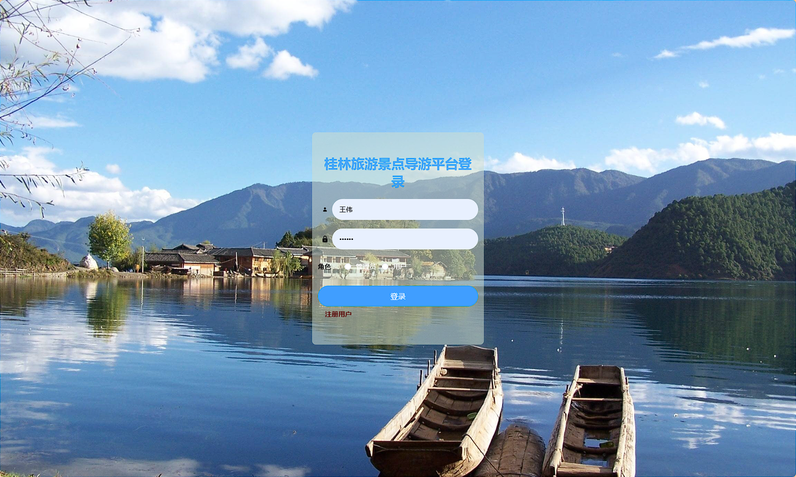

## 前台：
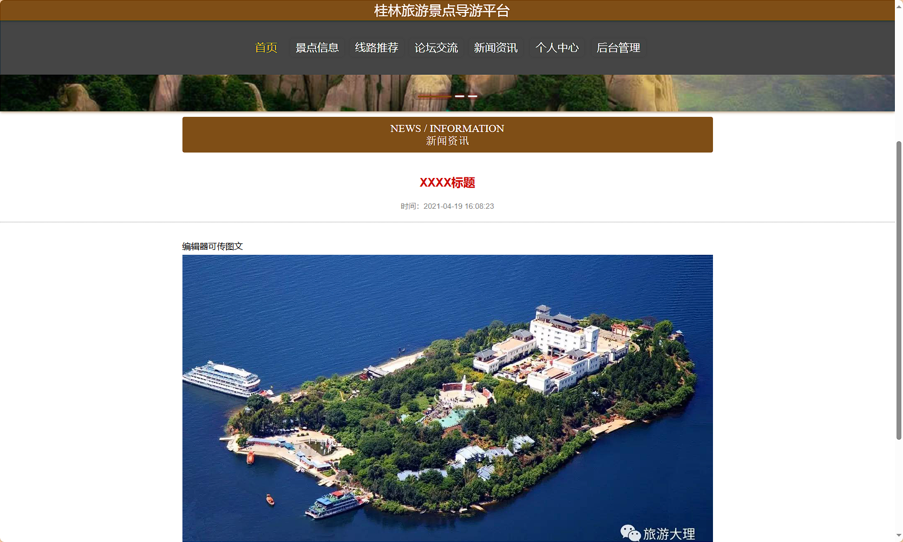
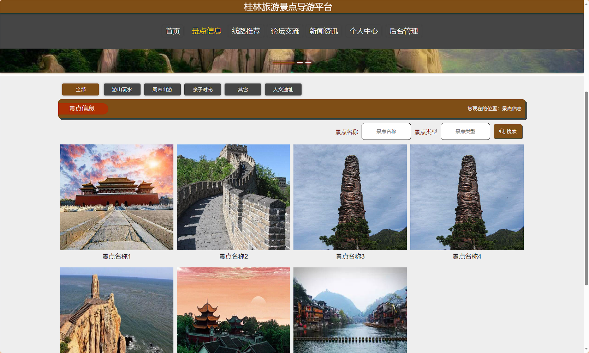
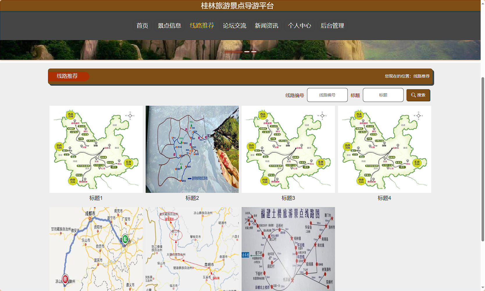
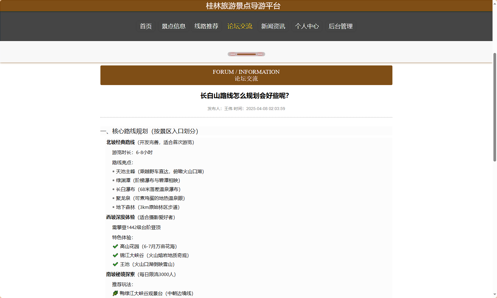
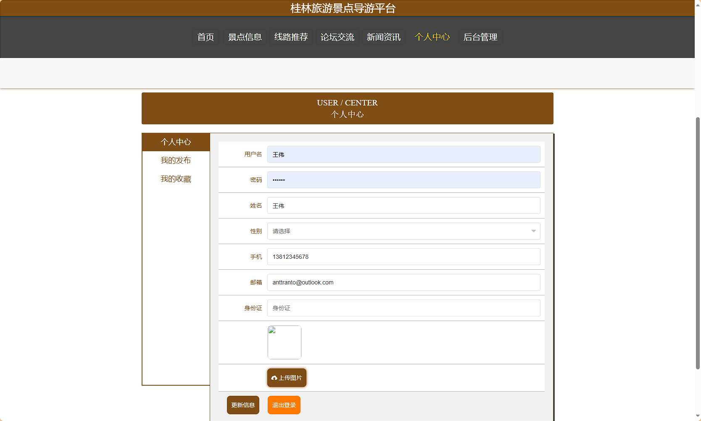

## 后台：
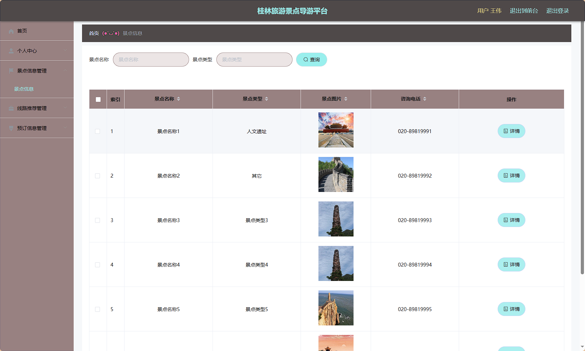
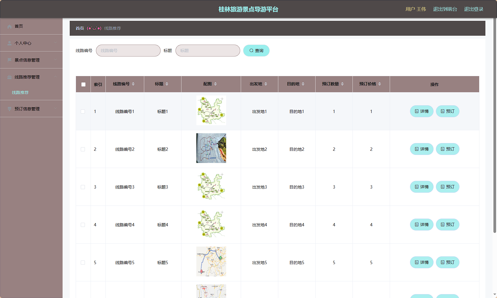
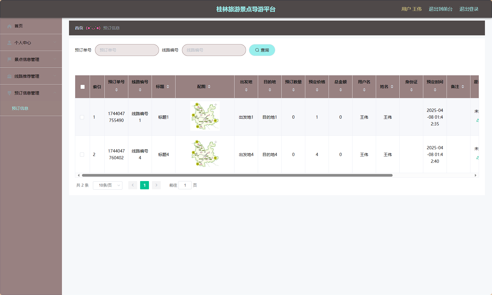
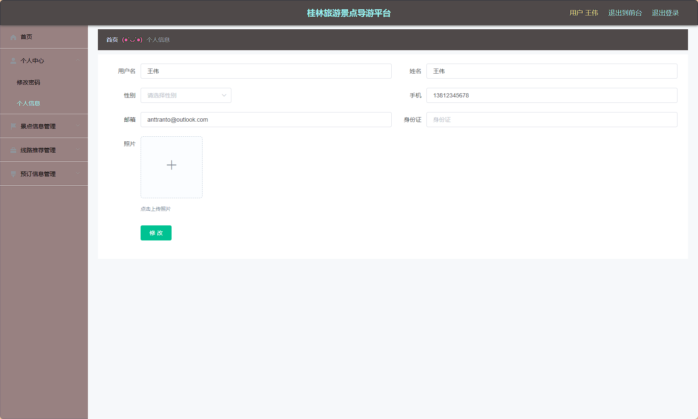
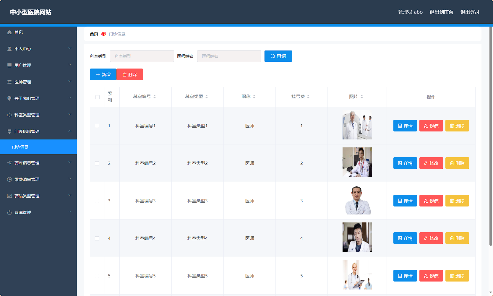
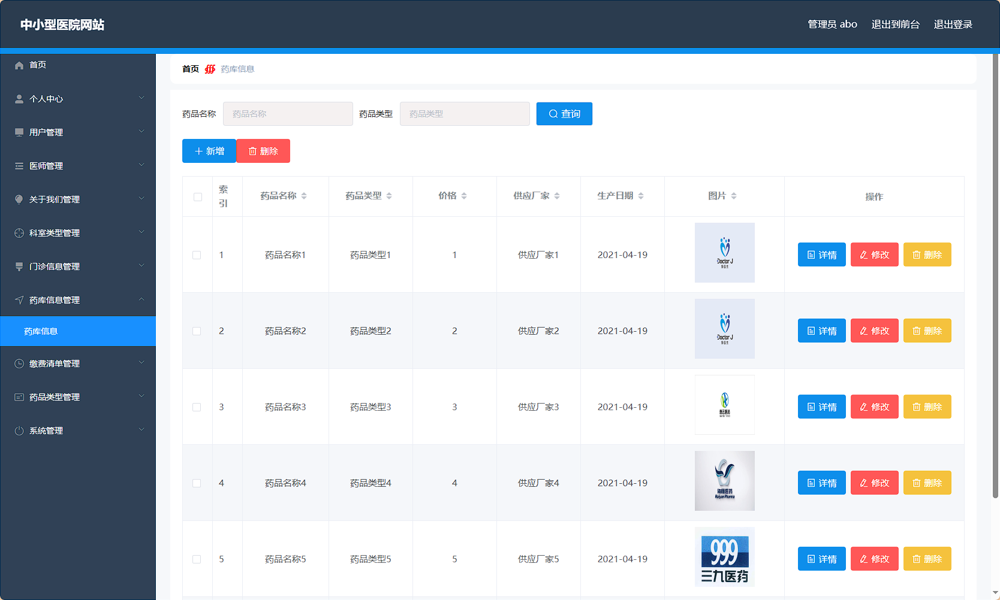
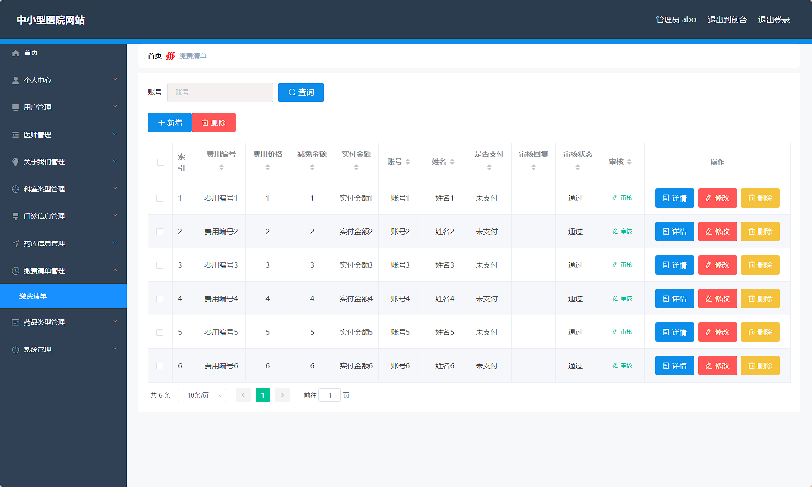

> 等等...

# 精选项目导航 & 快速部署工具
## 项目资源一站直达
- ​**访问项目导航站**：[点击进入](http://sysadmin.3vfree.vip)**快速检索所需项目名称**
- ​**技术栈全覆盖**：Java/SSm/Spring Boot/小程序等主流技术方案
- ​**配套资源**：每个项目均提供部署文档 + 演示视频（附效果截图）

### ▌导航站预览


### ▌工具界面预览


## 捐赠
> 博主将持续更新Java全栈开发项目，包含ssm，springboot，前后端分离系统等项目。
> 此外如果您够宽裕，请博主喝杯咖啡吧！捐赠将用于服务器维护与开源社区建设，感谢您的认可！
> 如需更多Java相关项目毕设3000+，有其他项目需求，sql文件等可联系博主v:xq-lucky311

---